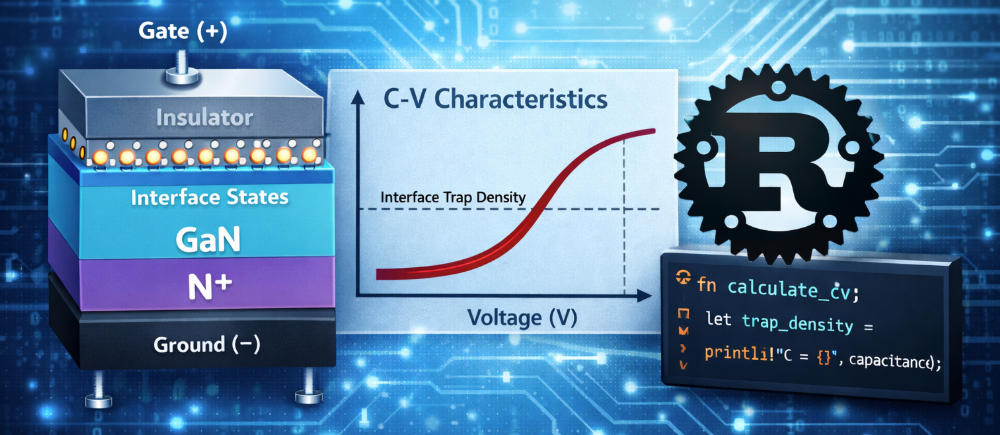

# GaN C-V Simulator

Simulates the C-V characteristics of n-GaN and GaN HEMT diodes.

## Install

### Quick install

curl -Ls https://raw.githubusercontent.com/WideBandAI/gan-cv-simulator/main/install.sh | sh

### Cargo

cargo install gan-cv-simulator

### Manual

Download binaries from GitHub Releases.